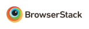

# Chalees Min School

Currently in private prototyping. More info coming in the future.

## Local Development

1. clone the repository
1. `cd` into the root folder of the repository
1. install [yarn](https://yarnpkg.com) if you don't have it already
1. run `yarn install`
1. to start a development server, run `yarn start`. A new browser tab will open automatically with the site in it once the initial build completes.

## Production Build

`npm run build` then check the `dist/` folder that is generated.

## Deployment

Instructions coming soon once we've decided how we plan to do this!

## Technology and Thanks

Chalees Min School is supported by the incredible work of many open source developers and a number of generous companies.

- 

  BrowserStack has graciously supported us with their Live and Screenshots features, which allows us to rapidly verify Chalees Min works well across a wide variety of desktop and mobile devices.
